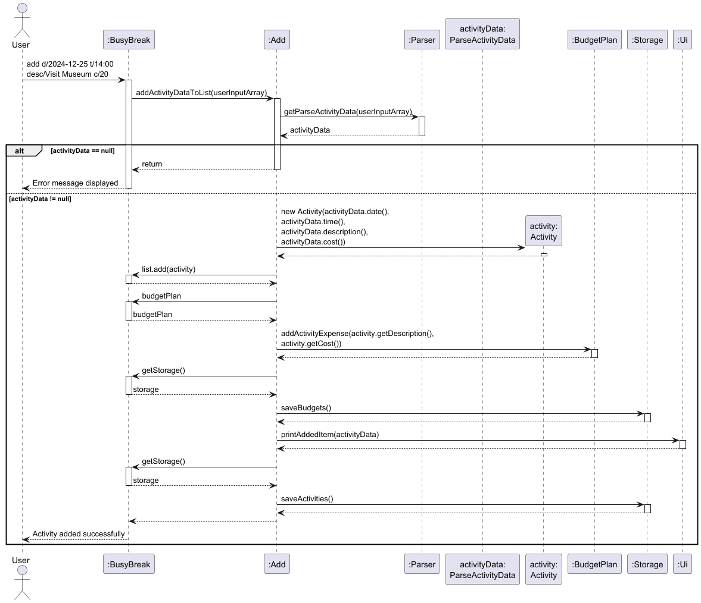

# Developer Guide

## Acknowledgements

{list here sources of all reused/adapted ideas, code, documentation, and third-party libraries -- include links to the
original source as well}

## Design & implementation

{Describe the design and implementation of the product. Use UML diagrams and short code snippets where applicable.}

---

### Feature: Time and Schedule Management

#### Design

Each activity and trip contains date and time information,
this feature enables the application to store, sort, and manage trip schedules based on time.

#### Implementation

It uses Java's built-in `java.time.LocalDateTime` library and other related libraries
to store time-related variables, to facilitate the standardization of time format and subsequent operations.
It also introduces a `schedule` command to compare the order of all activities and sort the output in chronological
order,
and use `schedule trip` command to sort trips.

#### Code Snippet

Time-related libraries used:

```
import java.time.LocalDate;
import java.time.LocalTime;
import java.time.LocalDateTime;
import java.time.format.DateTimeFormatter;
import java.time.format.DateTimeParseException;
```

The core code of the `schedule` command:

```
list.sort(Comparator.comparing(a -> a.getDateTimeObject().getDateTime()));
```

---

### Feature: Trip Management

#### Design

This feature allows users to add, list, and delete trips, each with start/end dates, start/end times, and a transport
mode.
Trips are validated to ensure valid time ranges (start before end).

#### Implementation

The TripCommand class handles these related commands:

* `trip add sd/START_DATE st/START_TIME ed/END_DATE et/END_TIME by/TRANSPORT`:
  Parses input fields, creates a Trip object, and adds it to `BusyBreak.trips`.
* `trip list`: Displays all trips with their details using `TripCommand.listTrips()`.
* `trip delete INDEX`: Removes the trip at the specified index from `BusyBreak.trips`.<br/>

All trip operations are persisted via `Storage.saveTrips()`.

#### Class Diagram

This diagram illustrates the `trip add` command.


---

### Feature: Data Range Check

#### Design

This feature enables users to query activities and trips within a specified date range (inclusive),
helping users review plans for a specific period.

#### Implementation

The Check class processes the `check from/yyyy-MM-dd to/yyyy-MM-dd` command:

* Parses the fromDate and toDate dates using `LocalDate`.
* Validates fromDate is not after toDate (can be the same).
* Filters activities: Includes activities where the activity date is between fromDate and toDate.
* Filters trips: Includes trips where the start date is between fromDate and toDate.
* Displays filtered results.

#### Activity Diagram

This activity diagram shows the logical flow of processing the `check` command,
including input validation and filtering.


---

### Feature: Data Clearing

#### Design

This feature allows users to clear data (activities, budgets, trips)
selectively or entirely, or clear entries before a specified date.

#### Implementation

The Clear class handles commands like:

* `clear`: Clears all activities.
* `clear budget`: Clears all budget entries.
* `clear trip`: Clears all trips.
* `clear all`: Clears all activities, budgets, and trips.
* `clear before yyyy-MM-dd`: Removes activities and trips before or on target date.

All operations update the respective data structures and persist changes via `Storage`.

#### Code Snippet

Clearing items before or on a date:

```
BusyBreak.list.removeIf(activity -> {
    LocalDate activityDate = activity.getDateTimeObject().getDate();
    return !activityDate.isAfter(targetDate);
});

BusyBreak.trips.removeIf(trip -> {
    LocalDate tripStartDate = trip.getStartDateTime().getDate();
    return !tripStartDate.isAfter(targetDate);
});
  
storage.saveActivities();
storage.saveTrips();
```

#### Activity Diagram

This activity diagram describes how the system handles
the `clear` command with different input.


---

### Feature: Data Storage and Loading

#### Design

This feature is responsible for storing activity, budget and trip data,
as well as loading previously saved data when the application starts.
It ensures that user data is retained between application sessions
by saving to files and retrieving from them.

#### Implementation

It uses Java's I/O libraries to handle file operations,
including creating necessary directories, writing data to files, and reading data from files.
The Storage class handles saving data into text files in a structured format (using "|" as a delimiter),
while the Load class handles parsing these text files and reconstructing the application's data structures with
validation for data integrity.

The Storage class saves data to text files:

* Activities: data/activities.txt (format: `date|time|description|cost`).
* Budgets: data/budgets.txt (format: `BUDGET|total` and `EXPENSE|name|amount|category`).
* Trips: data/trips.txt (format: `startDate|startTime|endDate|endTime|transport`).

#### Sequence Diagram

This sequence diagram depicts how the BusyBreak application loads data,
performs operations, and saves results.


---
### Feature: Budget Command

This feature enables users to manage their budgets through commands such as  
`budget set`, `budget add`, `budget delete`, `budget list`, `budget setcat`, and `budget sync`.  
It allows users to plan expenses, categorize them, and ensure their budgets remain up to date with activity costs.

---

### Design

The `Budget` class acts as the central controller for all budget-related operations in BusyBreak.  
It interprets the user input, validates parameters, and delegates logic to the `BudgetPlan` and `Storage` classes.

The design keeps the CLI interface (`handleBudget`) separate from data logic (`BudgetPlan`) and storage handling (`Storage`).

---

### Implementation

This method processes the subcommand specified by the user (set, add, delete, list, setcat, or sync)

### Class Diagram


---

---

### Feature: BudgetPlan

The `BudgetPlan` component manages all budget data for BusyBreak:
- holds expense entries (name, amount, category)
- tracks the **total budget**, **total spent**, and **remaining budget**
- enforces **Activity–Budget linking** rules (Activity-linked expenses cannot be added via `budget add`, nor edited/deleted via Budget commands)
- provides listing and category breakdown views
- syncs Activity items into the Budget view

---

### Design:

The BudgetPlan class serves as the core component for all budget management operations within BusyBreak.
It acts as the data model for storing, updating, and retrieving expenses and budget information, ensuring synchronization with activities and persistence through the Storage class.

It maintains three parallel ArrayLists — names, amounts, and categories — that collectively represent all expense entries, along with a totalBudget field that defines the user’s overall spending limit.
This design simplifies list traversal and maintains consistent indexing between expense attributes.

The `BudgetPlan` class is invoked by:
-  BudgetCommand : to execute user commands (budget set, budget add, budget delete, budget list, budget setcat, budget sync)
- BusyBreak : to initialize the budget system and pass activity data for synchronization 
- Storage : to save and load persistent budget data

The component ensures Activity–Budget is cross-compatable :
-	Expenses linked to Activity entries cannot be added, edited, or deleted through Budget commands.
-	Synchronization ensures Activity-linked costs remain up to date automatically.
-	Non-Activity expenses can be freely added, categorized, or removed.


### Implementation:

-	setBudget(double amount) – Sets the total available budget; throws an exception if the amount is negative.
-	getTotalBudget() – Returns the current total budget value.
-	getTotalSpent() – Calculates and returns the total amount spent across all recorded expenses.
-	getRemainingBudget() – Computes and returns the remaining budget (totalBudget - totalSpent).
-	addActivityExpense(String description, String costString) – Adds a new expense under the Activity category using parsed cost and description inputs.
-	removeActivityExpense(String description, String costString) – Removes an existing Activity-linked expense if it matches both name and cost.
-	updateActivityExpense(String oldDesc, String oldCostStr, String newDesc, String newCostStr) – Updates an Activity expense’s name and cost, matching entries by old values.
-	hasExpense(String name, String cost, String category) – Checks if an expense with the specified name, cost, and category exists.
-	syncFromActivities(List<Activity> activities) – Adds missing Activity-linked expenses to the budget, avoiding duplicates.
-	addExpense(String name, String cost, String category) – Adds a general expense entry after parsing cost and normalizing category.
-	deleteExpense(int oneBasedIndex) – Deletes an expense by index unless it’s linked to an Activity, printing a warning if restricted.
-	listExpenses() – Displays all recorded expenses, total spent, and remaining budget in a formatted box.
-	setExpenseCategory(int oneBasedIndex, String newCategory) – Updates the category of an expense unless it’s Activity-linked; prints confirmation or warning.
-	listByCategory() – Displays total spending grouped and sorted by category in descending order.


---


### Class Diagram

This diagram illustrates the relationships between `BudgetPlan`, `BudgetCommand`, and `BusyBreak`.


### Feature: Adding to list

#### Design

This lets a user add an activity to their travel itinerary with a date, time, cost and description.
It provides a way for users to build up a complete trip schedule activity by activity.

#### Implementation

The feature is implemented in through the addActivityDataToList method in the Add class.
User input is parsed through getParseActivityData in the Parser class, to extract date,time,cost and description from a
User's input.
This then creates an Activity object which is stored in an ArrayList.

#### Class Diagram

The diagram below illustrates the Add command class diagram:


#### Workflow

The diagram below illustrates the Add command workflow:


#### Sequence diagram

The following sequence diagram illustrates how an item is added in BusyBreak:



---

### Feature: Listing out all items

#### Design

The lets a user list out all current activities added to the itinerary. It provides a way for users to list
see the current itinerary at a glance.

#### Implementation

The feature is implemented in through the listItems method in the List class.
User input is then displayed to the user through printListItems in the Ui class.

#### Class Diagram

The diagram below illustrates the List command class diagram.


printListItems() logic:

- Checks if BusyBreak.list is empty
- Iterates through list
- Calls printItems() for each activity
- Displays: Date, Time, Description, Cost

#### Workflow

The following illustrates the workflow of the list command :


#### Sequence diagram

The following sequence diagram illustrates how listing items in BusyBreak functions:


---

### Feature: Finding a task

#### Design

This lets a user search for an existing activity through a keyword. This provides an easy way
for a user to search for an activity in the itinerary.

#### Implementation

The feature is implemented in through the searchByKeyword and isItemsFound methods in the Find class.
Found items are then printed to the user through printItems in the Ui class.

#### Class Diagram

The diagram below illustrates the Find command class diagram.


isItemsFound Search Logic:

- Converts keyword to lowercase
- Iterates through BusyBreak.list
- Checks if description contains keyword
- Prints matching items via Ui.printItems()
- Returns true if any items found

#### Workflow

The following illustrates the workflow of finding of items via a keyword:


#### Sequence diagram

The sequence diagram illustrates how items can be found via keyword in BusyBreak:


---

### Feature: Item management

#### Design

This feature allows users to delete certain items in their activity list or
edit certain details if necessary. It prevents unnecessary clutter within the
user's list.

#### Implementation

It uses Java's ArrayList implementation to handle the deletion of items, as well
as sets the variables of the Activity item at the relevant index when the user wants
to edit that item.

#### Class Diagram

The diagram below illustrates the Edit command class diagram.


The diagram below illustrates the Delete command class diagram.


#### Workflow

The diagram below illustrates the Edit command workflow:


The diagram below illustrates the Delete command workflow:


#### Sequence diagram

The following sequence diagram illustrates how an item is edited in BusyBreak:


The following sequence diagram illustrates how an item is deleted in BusyBreak:


---

#### Feature: View Itinerary

This feature allows the user to see all the activities scheduled on a specific date in
YYYY-MM-DD format. It prints each activity with its date, time, description, and cost
in a clean list.

#### Design

Allows a user to view all activities that are scheduled on a specific date (YYYY-MM-DD).
It validates input, filters the itinerary by date and displays only matching activities.

#### Implementation

The feature is implemented via viewInput(String[] userInputArray) in the View class.
This method validates the format of the command and date string, gathers relevant matches
and sends results to Ui.showItineraryFor(date, matches).

#### Class Diagram

The diagram below illustrates the View command class diagram.


viewInput() logic:

- Ensures that exactly 2 parts are passed: ["view", "<date>"]
- Trim and validate <date> using the correct format YYYY-MM-DD
- If BusyBreak.list is empty, Ui.showEmptyItinerary() is called
- Otherwise, iterate through BusyBreak.list:
    - For each Activity, compare activity.getDate() with <date>
    - Collate matches
- If there are no matches in the list, Ui.showNoActivitiesFor(date) is called
- Otherwise, Ui.showItineraryFor(date, matches) is called

#### Workflow

1. User enters view <YYYY-MM-DD>
2. View.viewInput() validates the command length and date format
3. If the input is invalid, Ui.showInvalidViewFormat() is called
4. If itinerary is empty, Ui.showEmptyItinerary() is called
5. Otherwise, filter the activities where getDate() == date
6. If there are no match in the itinerary, Ui.showNoActivitiesFor(date) is called
7. Otherwise, Ui.showItineraryFor(date, matches) to display all activities on that date

---

## Product scope

### Target user profile

{Describe the target user profile}

### Value proposition

{Describe the value proposition: what problem does it solve?}

## User Stories

| Version                        | As a ... | I want to ...             | So that I can ...                                           |
|--------------------------------|----------|---------------------------|-------------------------------------------------------------|
| seedu.busybreak.BusyBreak.v1.0 | new user | see usage instructions    | refer to them when I forget how to use the application      |
| v2.0                           | user     | find a to-do item by name | locate a to-do without having to go through the entire list |

## Non-Functional Requirements

{Give non-functional requirements}

## Glossary

* *glossary item* - Definition

## Instructions for manual testing

{Give instructions on how to do a manual product testing e.g., how to load sample data to be used for testing}
