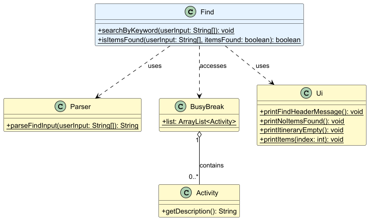

# Developer Guide

## Acknowledgements

{list here sources of all reused/adapted ideas, code, documentation, and third-party libraries -- include links to the
original source as well}

## Design & implementation

{Describe the design and implementation of the product. Use UML diagrams and short code snippets where applicable.}

---

### Feature: Time and Schedule Management

#### Design

Each activity contains date and time information,
this feature enables the application to store, sort, and manage trip schedules based on time.

#### Implementation

It uses Java's built-in `java.time.LocalDateTime` library and other related libraries
to store time-related variables, to facilitate the standardization of time format and subsequent operations.
It also introduces a `schedule` command to compare the order of all activities and sort the output in chronological
order

#### Code

Time-related libraries used:

```
import java.time.LocalDate;
import java.time.LocalTime;
import java.time.LocalDateTime;
import java.time.format.DateTimeFormatter;
import java.time.format.DateTimeParseException;
```

The core code of the `schedule` command:

```
list.sort(Comparator.comparing(a -> a.getDateTimeObject().getDateTime()));
```

---

### Feature: Data Storage and Loading

#### Design

This feature is responsible for storing activity and budget data,
as well as loading previously saved data when the application starts.
It ensures that user data is retained between application sessions
by saving to files and retrieving from them.

#### Implementation

It uses Java's I/O libraries to handle file operations,
including creating necessary directories, writing data to files, and reading data from files.
The Storage class handles saving activities and budget data into text files in a structured format (using "|" as a
delimiter),
while the Load class handles parsing these text files and reconstructing the application's data structures with
validation for data integrity.

---

### Feature: Budget Management

#### Design

The budget feature enables users to set a total budget and track spending during trip planning.
It helps monitor total expenses and remaining funds as activities are added or removed.

#### Implementation

The feature is implemented in the BudgetPlan class,
which stores the total budget and records each expense added by the user.
It validates inputs to prevent negative or invalid budget values and uses assertions to ensure data integrity.

---

### Feature: Adding to list

#### Design

This lets a user add an activity to their travel itinerary with a date, time, cost and description.
It provides a way for users to build up a complete trip schedule activity by activity.

#### Implementation

The feature is implemented in through the addActivityDataToList method in the Add class.
User input is parsed through getParseActivityData in the Parser class, to extract date,time,cost and description from a
User's input.
This then creates an Activity object which is stored in an ArrayList.

#### Class Diagram

The diagram below illustrates the Add command class diagram.


#### Workflow

1. Call Parser.getParseActivityData() to parse user input
2. If parsing fails (returns null), return early
3. Create new Activity object with parsed data
   (date, time, description, cost)
4. Add Activity to BusyBreak.list
5. Add expense to BudgetPlan using addActivityExpense()
6. Save budgets to storage file
7. Display confirmation via Ui.printAddedItem()
8. Save activities to storage file

---

### Feature: Listing out all items

#### Design

The lets a user list out all current activities added to the itinerary. It provides a way for users to list
see the current itinerary at a glance.

#### Implementation

The feature is implemented in through the listItems method in the List class.
User input is then displayed to the user through printListItems in the Ui class.

#### Class Diagram

The diagram below illustrates the List command class diagram.


printListItems() logic:

- Checks if BusyBreak.list is empty
- Iterates through list
- Calls printItems() for each activity
- Displays: Date, Time, Description, Cost

#### Workflow

1. Call Ui.printListItems()
2. Ui checks if BusyBreak.list is empty
3. If empty, show "Itinerary is Empty!"
4. Otherwise, iterate through list
5. Print each activity's details

---

### Feature: Finding a task

#### Design

This lets a user search for an existing activity through a keyword. This provides an easy way
for a user to search for an activity in the itinerary.

#### Implementation

The feature is implemented in through the searchByKeyword and isItemsFound methods in the Find class.
Found items are then printed to the user through printItems in the Ui class.

#### Class Diagram

The diagram below illustrates the Find command execution flow and its class diagram.



isItemsFound Search Logic:

- Converts keyword to lowercase
- Iterates through BusyBreak.list
- Checks if description contains keyword
- Prints matching items via Ui.printItems()
- Returns true if any items found

#### Workflow

1. Assert user input is not null
2. Check if BusyBreak.list is empty
3. If empty, show empty message and return
4. Parse user input to get keyword
5. Search through all activities
6. Match keyword with activity descriptions
   (case-insensitive)
7. Display matching activities
8. If no matches found, show no items message

---

### Feature: Item management

#### Design

This feature allows users to delete certain items in their activity list or
edit certain details if necessary. It prevents unnecessary clutter within the
user's list.

#### Implementation

It uses Java's ArrayList implementation to handle the deletion of items, as well
as sets the variables of the Activity item at the relevant index when the user wants
to edit that item.


---

#### Feature: View Itinerary

This feature allows the user to see all the activities scheduled on a specific date in
YYYY-MM-DD format. It prints each activity with its date, time, description, and cost
in a clean list.

#### Implementation

It is implemented through the view method in the BusyBreak class. It processes the command
view {date}, where the date must follow the YYYY-MM-DD format.


---

## Product scope

### Target user profile

{Describe the target user profile}

### Value proposition

{Describe the value proposition: what problem does it solve?}

## User Stories

| Version                        | As a ... | I want to ...             | So that I can ...                                           |
|--------------------------------|----------|---------------------------|-------------------------------------------------------------|
| seedu.busybreak.BusyBreak.v1.0 | new user | see usage instructions    | refer to them when I forget how to use the application      |
| v2.0                           | user     | find a to-do item by name | locate a to-do without having to go through the entire list |

## Non-Functional Requirements

{Give non-functional requirements}

## Glossary

* *glossary item* - Definition

## Instructions for manual testing

{Give instructions on how to do a manual product testing e.g., how to load sample data to be used for testing}
