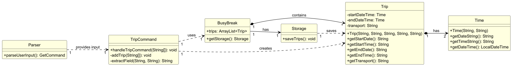
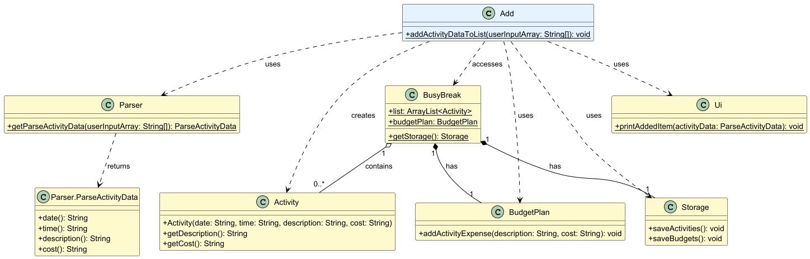
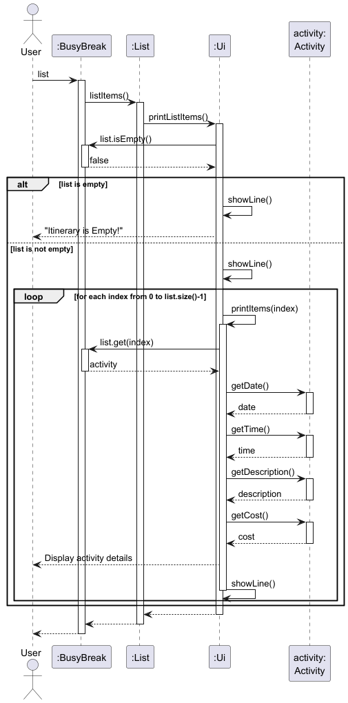
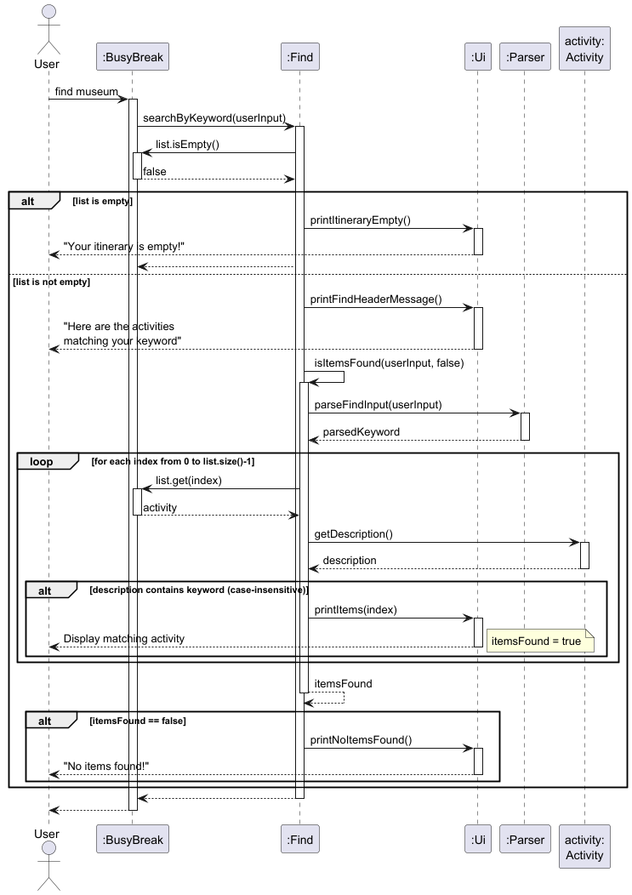
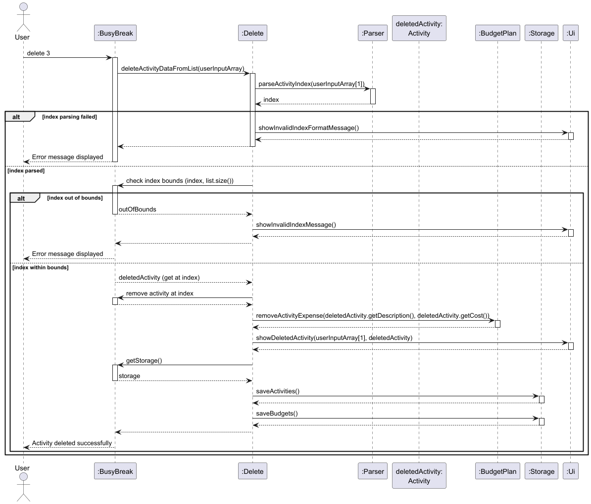

# Developer Guide

## Acknowledgements

BusyBreak uses the following tools in the Developer Guide, User Guide, and main code:

* [PlantUML](https://plantuml.com/) 
  * For creating UML diagrams
* [AddressBook-Level3 (AB3)](https://se-education.org/addressbook-level3/)
  * For the general structure of the User and Developer Guides
* [CS2113 Website](https://nus-cs2113-ay2526s1.github.io/website/index.html)
  * For the software expectations of BusyBreak
* [JUnit](https://junit.org/) 
  * For unit testing
* [Gradle](https://gradle.org/)
  * For the automating of builds

## Design & implementation

---

### Feature: Time and Schedule Management

#### Design

Each activity and trip contains date and time information,
this feature enables the application to store, sort, and manage trip schedules based on time.

#### Implementation

It uses Java's built-in `java.time.LocalDateTime` library and other related libraries
to store time-related variables, to facilitate the standardization of time format and subsequent operations.
It also introduces a `schedule` command to compare the order of all activities and sort the output in chronological
order,
and use `schedule trip` command to sort trips.

#### Code Snippet

Time-related libraries used:

```
import java.time.LocalDate;
import java.time.LocalTime;
import java.time.LocalDateTime;
import java.time.format.DateTimeFormatter;
import java.time.format.DateTimeParseException;
```

The core code of the `schedule` command:

```
list.sort(Comparator.comparing(a -> a.getDateTimeObject().getDateTime()));
```

---

### Feature: Trip Management

#### Design

This feature allows users to add, list, and delete trips, each with start/end dates, start/end times, and a transport
mode.
Trips are validated to ensure valid time ranges (start before end).

#### Implementation

The TripCommand class handles these related commands:

* `trip add sd/START_DATE st/START_TIME ed/END_DATE et/END_TIME by/TRANSPORT`:
  Parses input fields, creates a Trip object, and adds it to `BusyBreak.trips`.
* `trip list`: Displays all trips with their details using `TripCommand.listTrips()`.
* `trip delete INDEX`: Removes the trip at the specified index from `BusyBreak.trips`.<br/>

All trip operations are persisted via `Storage.saveTrips()`.

#### Class Diagram

This diagram illustrates the `trip add` command.


---

### Feature: Data Range Check

#### Design

This feature enables users to query activities and trips within a specified date range (inclusive),
helping users review plans for a specific period.

#### Implementation

The Check class processes the `check from/yyyy-MM-dd to/yyyy-MM-dd` command:

* Parses the fromDate and toDate dates using `LocalDate`.
* Validates fromDate is not after toDate (can be the same).
* Filters activities: Includes activities where the activity date is between fromDate and toDate.
* Filters trips: Includes trips where the start date is between fromDate and toDate.
* Displays filtered results.

#### Activity Diagram

This activity diagram shows the logical flow of processing the `check` command,
including input validation and filtering.


---

### Feature: Data Clearing

#### Design

This feature allows users to clear data (activities, budgets, trips)
selectively or entirely, or clear entries before a specified date.

#### Implementation

The Clear class handles commands like:

* `clear`: Clears all activities.
* `clear budget`: Clears all budget entries.
* `clear trip`: Clears all trips.
* `clear all`: Clears all activities, budgets, and trips.
* `clear before yyyy-MM-dd`: Removes activities and trips before or on target date.

All operations update the respective data structures and persist changes via `Storage`.

#### Code Snippet

Clearing items before or on a date:

```
BusyBreak.list.removeIf(activity -> {
    LocalDate activityDate = activity.getDateTimeObject().getDate();
    return !activityDate.isAfter(targetDate);
});

BusyBreak.trips.removeIf(trip -> {
    LocalDate tripStartDate = trip.getStartDateTime().getDate();
    return !tripStartDate.isAfter(targetDate);
});
  
storage.saveActivities();
storage.saveTrips();
```

#### Activity Diagram

This activity diagram describes how the system handles
the `clear` command with different input.


---

### Feature: Data Storage and Loading

#### Design

This feature is responsible for storing activity, budget and trip data,
as well as loading previously saved data when the application starts.
It ensures that user data is retained between application sessions
by saving to files and retrieving from them.

#### Implementation

It uses Java's I/O libraries to handle file operations,
including creating necessary directories, writing data to files, and reading data from files.
The Storage class handles saving data into text files in a structured format (using "|" as a delimiter),
while the Load class handles parsing these text files and reconstructing the application's data structures with
validation for data integrity.

The Storage class saves data to text files:

* Activities: data/activities.txt (format: `date|time|description|cost`).
* Budgets: data/budgets.txt (format: `BUDGET|total` and `EXPENSE|name|amount|category`).
* Trips: data/trips.txt (format: `startDate|startTime|endDate|endTime|transport`).

#### Sequence Diagram

This sequence diagram depicts how the BusyBreak application loads data,
performs operations, and saves results.


---
### Feature: Budget Command

The Budget Class is the command class that calls all budget related functions, it also prints out redirections if the 
user were to leave a field empty for instance. This class has one function, `handleBudget`, it's purpose is to split the 
command input and call the associated functions accordingly. This is why the command `breakdown`, despite being a budget
function as well is not called from this class but rather called directly from the BusyBreak class.

---

### Design

The `Budget` class acts as a supplemental Budget system for the BusyBreak app. It allows for additional expenses beyond
activity expenses to be logged, ensuring the user will be able to plan a budget accommodating all their needs.

It interprets the user input, validates parameters, and delegates logic to the `BudgetPlan` and `Storage` classes.

The design keeps the CLI interface (`handleBudget`) separate from data logic (`BudgetPlan`) and storage handling 
(`Storage`).


---

### Implementation

This feature enables users to manage their budgets through commands such as  
`budget set`, `budget add`, `budget delete`, `budget list`, `budget setcat`, and `budget sync`.  
It allows users to set budgets, plan expenses, categorize them, and ensure their budgets remain up to date with activity 
costs.

This method processes the subcommand specified by the user (set, add, delete, list, setcat, or sync)

### Class Diagram


---

---

### Feature: BudgetPlan

The `BudgetPlan` component manages all budget data for BusyBreak:
- holds expense entries (name, amount, category)
- tracks the **total budget**, **total spent**, and **remaining budget**
- enforces **Activity–Budget linking** rules (Activity-linked expenses cannot be added via `budget add`, 
nor edited/deleted via Budget commands)
- provides listing and category breakdown views
- syncs Activity items into the Budget view

---

### Design:

The BudgetPlan class serves as the core component for all budget management operations within BusyBreak.
It acts as the data model for storing, updating, and retrieving expenses and budget information, 
ensuring synchronization with activities and persistence through the Storage class.

It maintains three parallel ArrayLists — names, amounts, and categories — that collectively represent all expense 
entries, along with a totalBudget field that defines the user’s overall spending limit.
This design simplifies list traversal and maintains consistent indexing between expense attributes.

The `BudgetPlan` class is invoked by:
-  BudgetCommand : to execute user commands (budget set, budget add, budget delete, budget list, budget setcat, 
budget sync, breakdown)
- BusyBreak : to initialize the budget system and pass activity data for synchronization 
- Storage : to save and load persistent budget data

The component makes sure that Activity–Budget is cross-compatible :
-	Expenses linked to Activity entries cannot be added, edited, or deleted through Budget commands.
-	Synchronization ensures Activity-linked costs remain up to date automatically.
-	Non-Activity expenses can be freely added, categorized, or removed.

### Design Considerations and limitations

Why are activity expenses restricted from being changed through budget commands?

-While all activity expenses are a part of your budget, not all budget expenses will be activity related(snacks,hotels,
trains,etc). Hence this system allows for more flexibility on the user's end, while also being able to cover more 
avenues of their planning process.

-Although, the main reason for adopting this system, is to maintain consistency throughout the different classes. 
Activity objects have a date,time,description AND cost attached to it, the BudgetPlan class ignores the date and time, 
in an effort to reduce decision fatigue on the user, and also to prevent unnecessary repetition(for example, snacks can
be entered as a broad cost, the user might have snacks everyday, but the overall cost is the only thing that they would
need to consider when planning their overall budget).
- Also since no date/time is ever passed to the BudgetPlan Class, it would be unwise to allow budget functions to be 
used normally with activity objects that do have a date/time attached to them. (Example scenario: if normal budget 
functions were allowed and the user decides to delete an Activity cost through `budget delete`, it might work normally 
in the BudgetPlan class itself, however, when the user tries to access the normal list function for instance, this 
particular instance will be missing two fields, or worth case scenario might crash the app).


### Implementation:

-	setBudget(double amount) – Sets the total available budget; throws an exception if the amount is negative.
-	getTotalBudget() – Returns the current total budget value.
-	getTotalSpent() – Calculates and returns the total amount spent across all recorded expenses.
-	getRemainingBudget() – Computes and returns the remaining budget (totalBudget - totalSpent).
-	addActivityExpense(String description, String costString) – Adds a new expense under the Activity category 
using parsed cost and description inputs.
-	removeActivityExpense(String description, String costString) – Removes an existing Activity-linked expense if
it matches both name and cost.
-	updateActivityExpense(String oldDesc, String oldCostStr, String newDesc, String newCostStr) – Updates an 
Activity expense’s name and cost, matching entries by old values.
-	hasExpense(String name, String cost, String category) – Checks if an expense with the specified name, cost, 
and category exists.
-	syncFromActivities(List<Activity> activities) – Adds missing Activity-linked expenses to the budget, avoiding 
duplicates.
-	addExpense(String name, String cost, String category) – Adds a general expense entry after parsing cost and 
normalizing category.
-	deleteExpense(int oneBasedIndex) – Deletes an expense by index unless it’s linked to an Activity, printing a 
warning if restricted.
-	listExpenses() – Displays all recorded expenses, total spent, and remaining budget in a formatted box.
-	setExpenseCategory(int oneBasedIndex, String newCategory) – Updates the category of an expense unless it’s 
Activity-linked; prints confirmation or warning.
-	listByCategory() – Displays total spending grouped and sorted by category in descending order.


---


### Class Diagram

This diagram illustrates the relationships between `BudgetPlan`, `BudgetCommand`, and `BusyBreak`.


### Feature: Adding to list

#### Design

This lets a user add an activity to their travel itinerary with a date, time, cost and description.
It provides a way for users to build up a complete trip schedule activity by activity.

#### Implementation

The feature is implemented in through the addActivityDataToList method in the Add class.
User input is parsed through getParseActivityData in the Parser class, to extract date,time,cost and description from a
User's input.
This then creates an Activity object which is stored in an ArrayList.

#### Class Diagram

The diagram below illustrates the Add command class diagram:



#### Workflow

The diagram below illustrates the Add command workflow:


#### Sequence diagram

The following sequence diagram illustrates how an item is added in BusyBreak:


---

### Feature: Listing out all items

#### Design

The lets a user list out all current activities added to the itinerary. It provides a way for users to list
see the current itinerary at a glance.

#### Implementation

The feature is implemented in through the listItems method in the List class.
User input is then displayed to the user through printListItems in the Ui class.

#### Class Diagram

The diagram below illustrates the List command class diagram.


printListItems() logic:

- Checks if BusyBreak.list is empty
- Iterates through list
- Calls printItems() for each activity
- Displays: Date, Time, Description, Cost

#### Workflow

The following illustrates the workflow of the list command :


#### Sequence diagram

The following sequence diagram illustrates how listing items in BusyBreak functions:



---

### Feature: Finding a task

#### Design

This lets a user search for an existing activity through a keyword. This provides an easy way
for a user to search for an activity in the itinerary.

#### Implementation

The feature is implemented in through the searchByKeyword and isItemsFound methods in the Find class.
Found items are then printed to the user through printItems in the Ui class.

#### Class Diagram

The diagram below illustrates the Find command class diagram.


isItemsFound Search Logic:

- Converts keyword to lowercase
- Iterates through BusyBreak.list
- Checks if description contains keyword
- Prints matching items via Ui.printItems()
- Returns true if any items found

#### Workflow

The following illustrates the workflow of finding of items via a keyword:


#### Sequence diagram

The sequence diagram illustrates how items can be found via keyword in BusyBreak:



---

### Feature: Item management

#### Design

This feature allows users to delete certain items in their activity list or
edit certain details if necessary. It prevents unnecessary clutter within the
user's list.

#### Implementation

It uses Java's ArrayList implementation to handle the deletion of items, as well
as sets the variables of the Activity item at the relevant index when the user wants
to edit that item.

#### Class Diagrams

The diagram below illustrates the Edit command class diagram.


The diagram below illustrates the Delete command class diagram.


#### Workflows

The diagram below illustrates the Edit command workflow:


The diagram below illustrates the Delete command workflow:


#### Sequence diagrams

The following sequence diagram illustrates how an item is edited in BusyBreak:


The following sequence diagram illustrates how an item is deleted in BusyBreak:



---

#### Feature: View Itinerary

This feature allows the user to see all the activities scheduled on a specific date in
YYYY-MM-DD format. It prints each activity with its date, time, description, and cost
in a clean list.

#### Design

Allows a user to view all activities that are scheduled on a specific date (YYYY-MM-DD).
It validates input, filters the itinerary by date and displays only matching activities.

#### Implementation

The feature is implemented via viewInput(String[] userInputArray) in the View class.
This method validates the format of the command and date string, gathers relevant matches
and sends results to Ui.showItineraryFor(date, matches).

#### Class Diagram

The diagram below illustrates the View command class diagram.


viewInput() logic:

- Ensures that exactly 2 parts are passed: ["view", "<date>"]
- Trim and validate <date> using the correct format YYYY-MM-DD
- If BusyBreak.list is empty, Ui.showEmptyItinerary() is called
- Otherwise, iterate through BusyBreak.list:
    - For each Activity, compare activity.getDate() with <date>
    - Collate matches
- If there are no matches in the list, Ui.showNoActivitiesFor(date) is called
- Otherwise, Ui.showItineraryFor(date, matches) is called

#### Workflow

1. User enters view <YYYY-MM-DD>
2. View.viewInput() validates the command length and date format
3. If the input is invalid, Ui.showInvalidViewFormat() is called
4. If itinerary is empty, Ui.showEmptyItinerary() is called
5. Otherwise, filter the activities where getDate() == date
6. If there are no match in the itinerary, Ui.showNoActivitiesFor(date) is called
7. Otherwise, Ui.showItineraryFor(date, matches) to display all activities on that date

#### Sequence diagram

The sequence diagram illustrates how the user can view all the activities scheduled on a specific day


---

#### Feature: Undo

This feature allows the user to revert the application state to the most recent
checkpoint created before a mutating command

#### Design

Uses a folder-based snapshot system (History) that saves activities, budgets, and trips before each mutating command. 
On undo, it restores the latest snapshot, resets in-memory state, reloads via Load, and reports status via Ui.

#### Implementation

The feature is implemented via undoInput(String[] args) in the Undo class.
This method validates the command format, consults History for a snapshot,
restores files if available, resets in-memory state, reloads via Load, and
notifies the user via Ui.

#### Class Diagram

The diagram below illustrates the Undo command class diagram.


undoInput() logic:

- Ensures exactly one token is passed: "undo"
- Check History.hasSnapshots():
  - If false, calls Ui.showNothingToUndo() and return
- Call History.restoreLatest():
  - If empty, calls Ui.showNothingToUndo() and return
- Reset in-memory state:
  - BusyBreak.list.clear()
  - BusyBreak.trips.clear()
  - BusyBreak.budgetPlan = new BudgetPlan()
- Reload from restored files:
  - Load.loadActivities()
  - Load.loadBudgets()
  - BusyBreak.budgetPlan.syncFromActivities(BusyBreak.list)
  - Load.loadTrips()
- Call Ui.showUndoSuccess()

#### Workflow

1. User types in "undo"
2. Undo.undoInput() validates format (must be a single token)
3. History.hasSnapshots() is checked 
4. If none, Ui.showNothingToUndo() and return 
5. History.restoreLatest() copies the latest snapshot’s files back into data 
6. In-memory state is reset (list, trips, budgetPlan)
7. Load reloads activities, budgets, and trips from restored files 
8. budgetPlan.syncFromActivities(list) ensures Activity-linked expenses are aligned 
9. Ui.showUndoSuccess() notifies completion

#### Sequence Diagram
The following sequence diagram illustrates how you can undo an action in BusyBreak:


---

## Product scope

### Target user profile

BusyBreak is designed for travelers who:
* Can type fast 
* Are comfortable using CLI based applications
* Want to organize detailed itineraries
* Need to quickly search,edit and reorganize travel plans
* Prefer a lightweight itinerary tracker

### Value proposition

Helps travellers track their itinerary planning using a CLI based tool that contains itinerary management,
schedule organisation and budget tracking. It is designed to be lightweight being a CLI 
based application, and solves the issue of having fragmented travel planning 
from using multiple apps or documents. It is also lightweight and easy to use,
being CLI based.

## User Stories

| Version | As a ...                 | I want to ...                                                    | So that I can ...                                                 |
|---------|--------------------------|------------------------------------------------------------------|-------------------------------------------------------------------|
| v1.0    | planner                  | add daily itinerary items                                        | know what activities I have planned                               |
| v1.0    | traveller                | delete daily itinerary items                                     | have my list remain uncluttered                                   |
| v1.0    | budget-conscious planner | set an overall or daily budget for the trip                      | control my total spending                                         |
| v1.0    | traveller                | edit my daily itinerary items                                    | easily change my activity details                                 |
| v1.0    | traveller                | view my entire itinerary timeline                                | have an overview of the things I will be doing for the trip       |
| v1.0    | traveller                | view my itinerary for a specific day                             | have an overview of the things I will be doing for the day        |
| v1.0    | traveller                | sort activities in my itinerary by time                          | I know the order of my activities                                 |
| v2.0    | traveller                | save and load all my items                                       | not key them in every time I restart the application              |
| v2.0    | traveller                | add transport details                                            | plan how to get from place to place                               |
| v2.0    | planner                  | check activities and trips in a certain period                   | know if I can easily alter my schedule in that period             |
| v2.0    | frequent traveller       | clear all my list items                                          | start a new itinerary from scratch                                |
| v2.0    | frequent traveller       | clear all my transport details and budget                        | re-use my  itinerary for different countries easily               |
| v2.0    | traveller                | clear activities and trips scheduled on or before a certain date | remove past or cancelled plans without affecting future ones      |
| v2.0    | traveller                | sort transport by time                                           | see my transports in chronological order along side my activities |
| v2.0    | traveller                | edit individual activity fields                                  | update specific details without reentering the entire item        |
| v2.0    | planner                  | undo the last change                                             | recover from accidental changes easily                            |
| v2.0    | user with a long list    | find a item by name                                              | locate an activity without having to go through the entire list   |
| v2.0    | budget-conscious planner | manually add expenses                                            | track non-activity costs                                          |
| v2.0    | budget-conscious planner | categorise expenses and view the breakdown                       | understand where my money is going                                |
| v2.0    | budget-conscious planner | automatically add activity costs into the budget                 | keep the budget accurate without double entries                   |

## Non-Functional Requirements

1. Should work on Windows/MacOS/Linux provided it has Java 17 installed.
2. Program response time should not exceed 3 seconds for any command.
3. A user with a good command of the keyboard should be able to do most tasks easier than using a mouse.

## Glossary

* *CLI* - Command Line Interface. The only means of interacting with BusyBreak
* *Snapshot* - A timestamp of the data directory created before mutating each entry with `undo`.

## Instructions for manual testing

### Launch and Shutdown

1. Initial launch <br/>
a. Download the jar file in an empty folder.<br/>
b. Open a terminal and cd into the folder that the jar file was saved in.
c. Run `java -jar busybreak.jar`

2. Shutdown<br/>
a. Input the`exit` command into BusyBreak, and the program will exit by itself.

### Adding activities
a. Test case: `add d/2025-10-31 t/13:00 desc/eat lunch c/15`
* Expected: Activity is added to the list. Description "eat lunch", 
cost "15", date "2025-10-31", time "13:00" are correctly stored. Status message confirms successful addition.

b. Test case: `add d/2025-10-31 t/13:00 desc/eat|lunch c/15`
* Expected: Activity is not added. Error message says cannot contain the '|' character. List remains unchanged.

c. Test case: `add d/2021-13-32 t/13:00 desc/thing c/15`
* Expected: Activity is not added. Error message notifies of invalid date. List unchanged.

d.Test case: `add d/2025-10-31 t/13:00 desc/ c/15`
* Expected: Activity is not added. Error message indicates description "is empty". List unchanged.

e. Test case: `add t/13:00 desc/eat lunch c/15`
* Expected: Activity is not added. Error message notifies of missing date. List unchanged.

### Editing activities
a. Prerequisites: List has at least one activity (use add to create one if needed).

b. Test case: `edit 1 d/2001-09-11 t/08:46 desc/new description c/21`
* Expected: Activity 1 is updated with the same details when listed.

c. Test case: `edit 1 c/21 d/2001-09-11 t/08:46`
* Expected: Only specified fields are updated (cost, date, time). Description remains unchanged.

d. Test case: `edit 99 d/2025-01-01`
* Expected: Error message is shown. No changes to any activity.

e. Test case: `edit xxx d/2025-01-01`
* Expected: No changes. Error message is shown.

f. Test case: `edit 1 xxx/21`
* Expected: No changes. Error message is shown.

g. Test case: `edit 1`
* Expected: No changes. Error message is shown.

### Listing activities
a. Test case: `list` (with no activities added)
* Expected: Itinerary is empty.

b. Add activities:<br/>
`add d/2025-01-01 t/13:00 desc/activityA c/15`<br/>
`add d/2025-01-01 t/13:00 desc/activityB c/15`<br/>
`add d/2025-01-01 t/13:00 desc/activityC c/15`<br/>

Test case: `list`
* Expected: All 3 activities displayed, in order of adding.

### Viewing activities
a. Prerequisites: Ensure multiple activities exist with different dates.
Example: <br/>
`add d/2025-10-09 t/09:00 desc/visit museum c/67`<br/>
`add d/2025-10-10 t/14:00 desc/go shopping c/100`<br/>

Test case: `view 2025-10-09`
* Expected: Only one activity (visit museum) is shown.

### Deleting activities
a. Prerequisite: List all activities using `list` command. Ensure multiple activities in the list.

b. Test case: `delete 1`
* Expected: First activity is removed from the list. Remaining activities shift up and order is preserved.
Status message confirms deletion.

c. Test case: `delete 99`
* Expected: No activity is deleted. List remains unchanged. Error message is shown.

d. Test case: `delete xxx`
* Expected: No activity is deleted. List remains unchanged. Error message is shown.

### Managing trips
a. Test case: `trip add sd/2025-01-01 st/00:01 ed/2025-01-01 et/12:00 by/plane`
* Expected: Trip is successfully added. 

b. Test case: <br/>
`trip add sd/2025-01-01 st/00:01 ed/2025-01-01 et/12:00 by/plane`<br/>
`trip add sd/2025-01-01 st/00:01 ed/2025-01-01 et/12:00 by/plane`
* Expected: Second duplicate trip is not added again. Error message is shown.

c. Test case:`trip list` (no trips added)
* Expected: Message indicates no trips added.

d. Test case: `trip delete 99`
Expected: No trip is deleted. Error message is shown.

e. Test case: `trip invalid`
Expected: Error message is shown.

### Sorting trips
a. Prerequisite: Add multiple trips with non-overlapping times:<br/>
`trip add sd/2025-01-03 st/08:00 ed/2025-01-03 et/12:00 by/train`<br/>
`trip add sd/2025-01-01 st/08:00 ed/2025-01-01 et/18:00 by/flight`<br/>
`trip add sd/2025-01-02 st/08:00 ed/2025-01-02 et/10:00 by/car`<br/>

b. Test case: `schdule trip`
* Expected: Trips are sorted by start date/time.

c. Add overlapping trips: <br/>
`trip add sd/2025-01-01 st/08:00 ed/2025-01-01 et/18:00 by/flight`<br/>
`trip add sd/2025-01-01 st/10:00 ed/2025-01-01 et/12:00 by/car`<br/>

Test case: `schedule trip`
* Expected: Sorting fails. Error message is shown.


### Checking activities and trips in date range
a. Prerequisite: Add at least one activity and one trip within the range:<br/>
`add d/2025-01-02 t/10:00 desc/Test Activity c/50`<br/>
`trip add sd/2025-01-02 st/08:00 ed/2025-01-02 et/18:00 by/car`<br/>

b. Test case:`check from/2025-01-01 to/2025-02-02`
* Expected: Both results shown.

c. Test case: `check from/2025-01-05 to/2025-01-03`
* Expected: Error message is shown.

### Clearing data
a. Prerequisite: Add at least one trip and one activity:<br/>
`add d/2025-01-02 t/10:00 desc/Test Activity c/50`<br/>
`trip add sd/2025-01-02 st/08:00 ed/2025-01-02 et/18:00 by/car`<br/>

b. Test case: `clear`
* Expected: All activities are cleared.

c. Test case: `clear trip`
* Expected: All trips are cleared.

### Budget management
a. Test case: `budget set 100`
* Expected: Total budget set at 100

b. Test case `budget set -1`
* Expected: Error message shown.

c. Test case: `budget add n/Souvenir c/100 cat/Shopping`
* Expected: Expense "Souvenir" added under "Shopping". Total spent: 100.

d. Test case: `budget delete 1` (continue from previous test case)
* Expected: "Souvenir" removed. Budget returns to 100.

e. Test case: `budget setcat 1 Food` (continue from test case c)
* Expected: Category changed to Food. Amount and totals remain unchanged.

### Finding an item
a. Prerequisite: Add activities:<br/>
`add d/2025-01-01 t/13:00 desc/eat lunch c/15`<br/>
`add d/2025-01-01 t/13:00 desc/eat breakfast c/15`<br/>
`add d/2025-01-01 t/13:00 desc/eat dinner c/15`<br/>

b. Test case: `find LUNCH`
* Expected: "eat lunch" activity is listed.

c. Test case: `find eat`
* Expected: All 3 activities are listed.

### Undoing a change
a. Prerequisite: Make a change:<br/>
`add d/2025-01-01 t/13:00 desc/eat lunch c/15`<br/>
`delete 1`

b. Test case: `undo`
* Expected: Activity shows in the list

### Exiting the program	
a. Test case: `exit`
* Expected: Program will terminate

